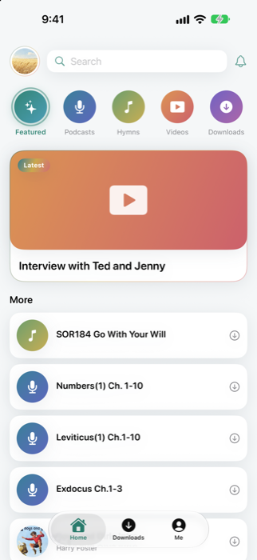
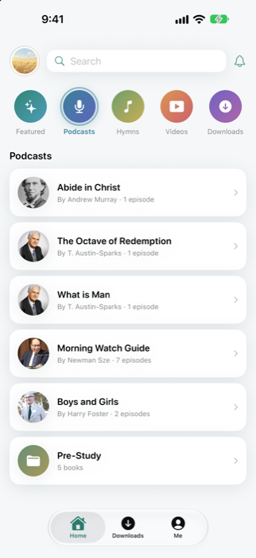
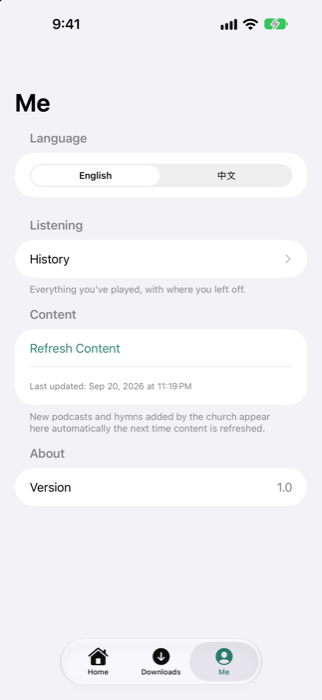

# 拾穗 SJCA — Church App

An iPhone app for my church, San Jose Christian Assembly, to share sermons, hymns, and videos with the congregation in English and Chinese. I built it myself, start to finish, and submitted it to the App Store.

<p align="center">
  
  
  
</p>

## Why I made it

The church wanted a simple way to get sermons and music out to everyone without paying for some third-party podcast app, and a lot of the congregation reads Chinese more comfortably than English. So the app does both languages, and you can flip between them whenever you want.

## What it can do

- Sermons, hymns, and videos, sorted into categories
- Switch between English and Chinese from inside the app
- Download stuff to listen to offline
- Keeps playing audio in the background, even with the screen off
- Picks up right where you left off
- New content shows up on its own — I don't have to push an app update every time there's a new sermon

## Built with

Swift and SwiftUI, AVFoundation for the audio/video player, XcodeGen for the project file, and Firebase for hosting the media.

## How it works

There's a small bit of content built right into the app, so it works even with zero internet. Past that, it checks a hosted file online every time it opens, and if there's anything new it swaps it in. That's the whole trick behind adding new sermons without ever touching the App Store again.

If you want to see how it's set up in more depth, or turn this into something for your own church, that's in [docs/CUSTOMIZING.md](docs/CUSTOMIZING.md).

## Running it

```bash
git clone https://github.com/allenlong2007/ChurchApp.git
cd ChurchApp
xcodegen generate
open ChurchApp.xcodeproj
```

Needs [XcodeGen](https://github.com/yonaskolb/XcodeGen) (`brew install xcodegen`) and Xcode. Pick the ChurchApp scheme, pick a simulator, hit run.

## Status

Sitting in App Store review right now.
