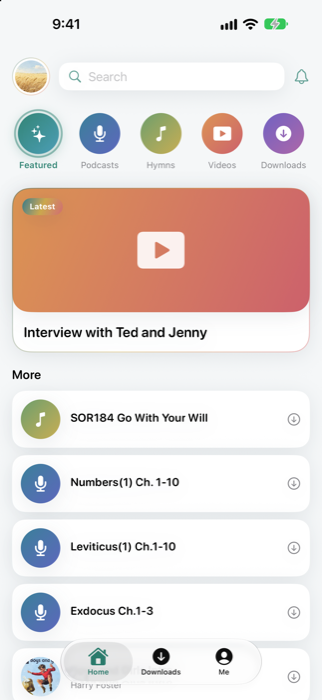
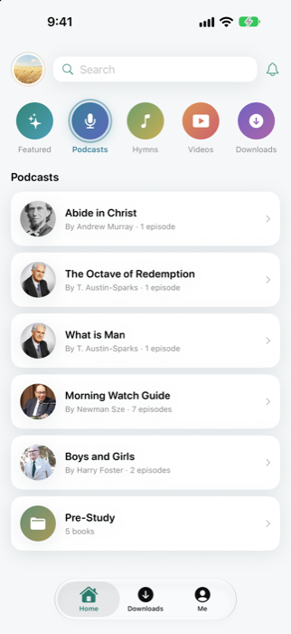
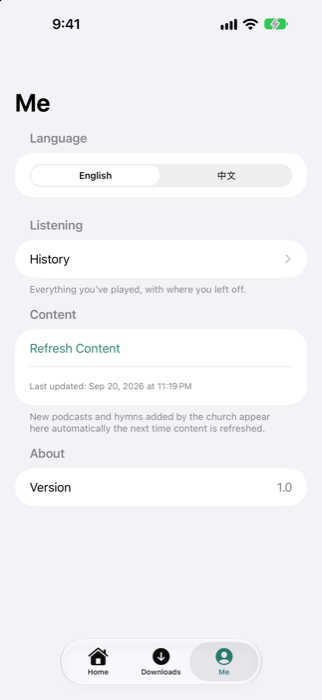

# 拾穗 SJCA: Church App

An iPhone app for my church, San Jose Christian Assembly. People use it to listen to sermons and hymns, and watch videos, in English or Chinese. I built it myself, start to finish, and it's [live on the App Store](https://apps.apple.com/us/app/%E6%8B%BE%E7%A9%97-sjca/id6814304145) now.

<p align="center">
  
  
  
</p>

## Why I made it

The church wanted an easy way to get sermons and music in front of the congregation without paying for a third-party podcast app. A lot of the congregation reads Chinese more comfortably than English too. So the app supports both languages, and you can switch between them anytime.

## What it can do

Sermons, hymns, and videos are sorted into categories you can browse. You can switch the whole app between English and Chinese from inside it. Anything can be downloaded for offline listening. Audio keeps playing in the background, even with the screen off, and it remembers exactly where you left off. New content shows up on its own too, so I don't have to push an app update every time a sermon gets added.

## Built with

Swift and SwiftUI, AVFoundation for the audio and video player, XcodeGen for the project file, and Firebase to host the media.

## How it works

A small set of content is built right into the app, so it works even with no internet at all. Every time it opens, it checks a hosted file online for anything new and swaps it in if there is. That's how new sermons get added without ever touching the App Store again.

More on how it's set up, or how to turn this into something for another church, is in [docs/CUSTOMIZING.md](docs/CUSTOMIZING.md).

## Running it

```bash
git clone https://github.com/allenlong2007/ChurchApp.git
cd ChurchApp
xcodegen generate
open ChurchApp.xcodeproj
```

Needs [XcodeGen](https://github.com/yonaskolb/XcodeGen) (`brew install xcodegen`) and Xcode. Pick the ChurchApp scheme, pick a simulator, hit run.

## Tests

The unit tests cover the language switching, the Chinese folder names, and the content file that ships inside the app (unique IDs, valid links, no folder pointing at a parent that doesn't exist). The language tests exist because of a real bug: the app stores Chinese as `zh-Hans`, and an early check for plain `zh` quietly never matched. Run them with Cmd+U in Xcode, or:

```bash
xcodebuild test -project ChurchApp.xcodeproj -scheme ChurchApp -destination 'platform=iOS Simulator,name=iPhone 17'
```

## Status

[Live on the App Store](https://apps.apple.com/us/app/%E6%8B%BE%E7%A9%97-sjca/id6814304145).
